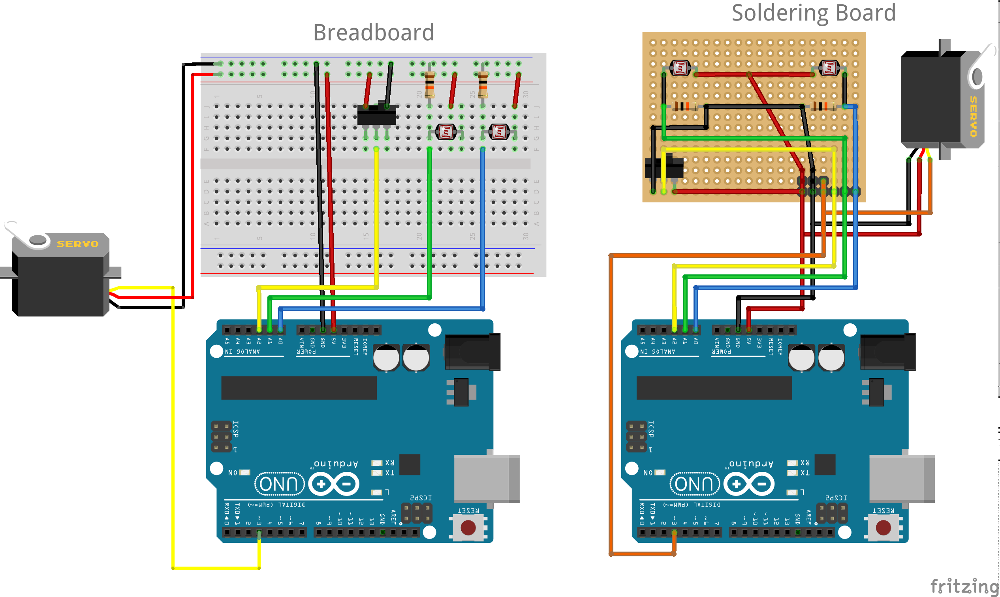
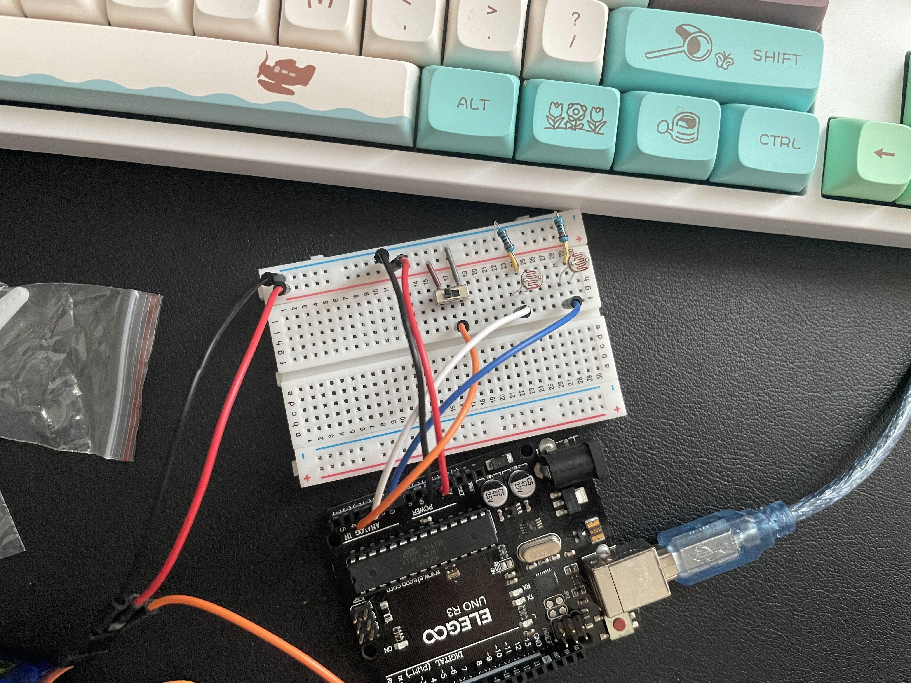
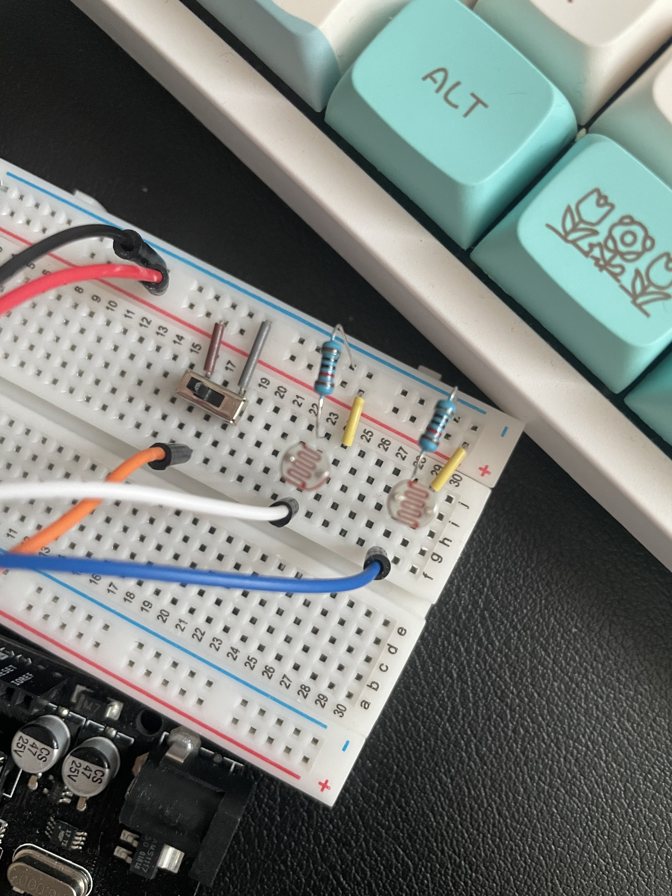
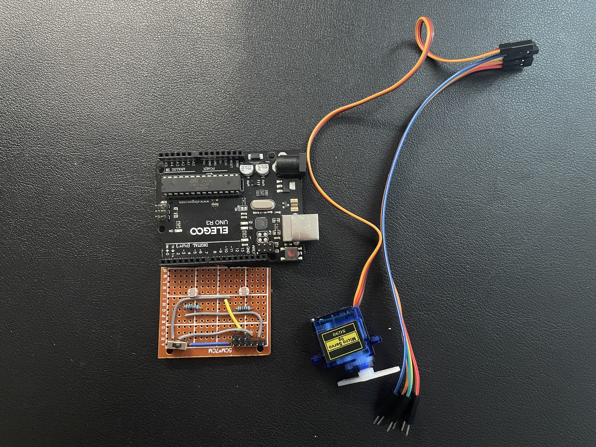
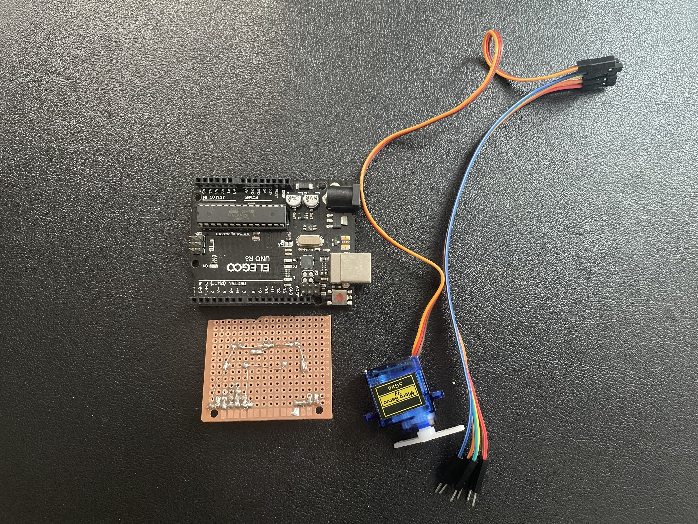
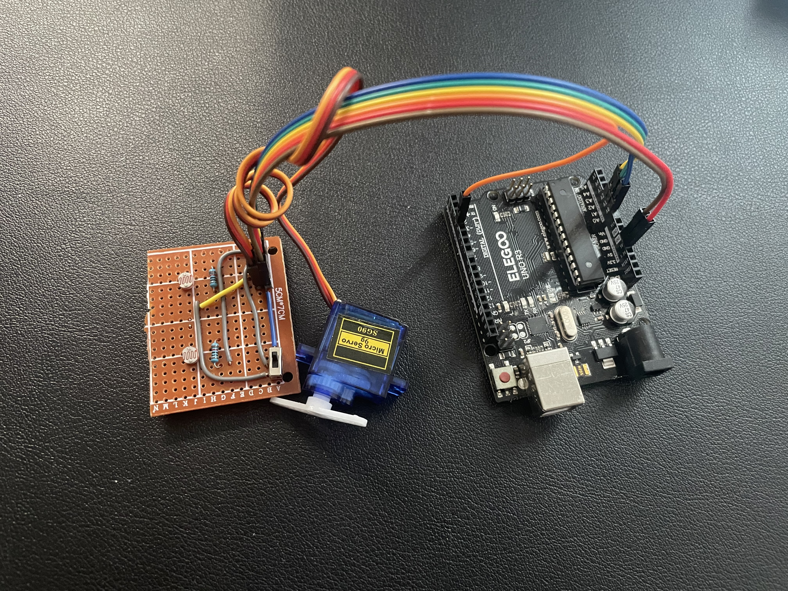

# Arduino Solar Tracker Project 
## Overview
This Arduino Solar Tracker project is designed to automatically angle a solar panel in the direction of the highest light intensity. It uses two light-dependent resistors (LDRs) to detect light levels and a servo motor to adjust the panel's angle.

## Components
| Item          | Description                    | Quantity     |
| ------------- | ------------------------------ | ------------ |
| Arduino UNO   | Main Microcontroller           | 1            |
| GL5516        | Light-Dependent Photoconductor | 2            |
| $10k\ohm$     | $10k\ohm$                      | 2            |
| SG90          | Servo Motor                    | 1            |
| Toggle Switch | Toggle Switch                  | 1            |
| PCB Board     | Soldering Board                | 1            |
| Breadboard    | Test Breadboard                | 1            |
| Jumper Wires  | Jumper Wires                   | As needed    |

## Libraries Required
- `Servo.h`: For controlling the servo motor.
- `ArduinoJson.h`: For handling JSON, primarily used for debugging purposes. (https://arduinojson.org)

## Circuit Connections
- Servo Motor to Pin `~3` (PWM)
- Left LDR to Pin `A0` (Analog Read)
- Right LDR to Pin `A1` (Analog Read)
- Toggle Switch to Pin `A2` (Digital Read)

### Schematics

    
Actual Prototypes

#### Breadboard Overall

#### Breadboard Closeup

#### Soldering Board Front

#### Soldering Board Back

#### Soldering Board Wire

#### Soldering Board Partition 1

#### Soldering Board Partition 2

## Functionality
- **Light Tracking**: The LDRs measure light intensity. The system adjusts the servo to align with the higher light intensity side.
- **Servo Control**: The servo motor rotates to position the system based on LDR readings.
- **Toggling**: A toggle switch is used to stop tracking manually.
- **Scaling**: Sensor readings are scaled for more consistent performance.
- **Debugging**: Serial communication outputs JSON formatted data for debugging.

## Calibration
For accurate light tracking, it might be crucial to calibrate the LDR sensors. Follow these steps:
1. **Toggle the Switch**: Temporarily stop tracking lights by toggling the switch. This will allow users to easier to calibrate LDR sensors.
2. **Calibrate for Darkness**: Cover both LDRs completely to simulate darkness. This sets the minimum threshold for the sensor readings.
3. **Calibrate for Maximum Brightness**: Shine a flashlight directly on the LDRs to set the maximum threshold.
4. **Testing**: After calibration, turn on the tracking system by toggling the switch; expose the LDRs to varying light conditions to ensure the servo adjusts the panel's angle accurately.

This calibration helps the system differentiate between various light intensities more effectively.

## Code Structure
- **Setup**: Initializes serial communication, servo, and input pins.
- **Main Loop**: Reads sensor values, processes them, and adjusts the servo angle accordingly.
- **Classes and Functions**:
	- `Scaler`: Scales sensor readings.
	- `servoAngle()`: Ensures servo angle stays within valid range.

## Usage
1. Assemble the circuit as per the schematic.
2. Upload the provided code to your Arduino board.
3. Adjust the solar panel so it initially faces upwards.
4. The system will automatically adjust the panel towards the brightest light source.

## Debugging
- Monitor the serial output for real-time sensor data and system status in JSON format.

## Customization
- Adjust the `threshold` and `speed` constants to tweak the responsiveness and movement speed of the servo.
